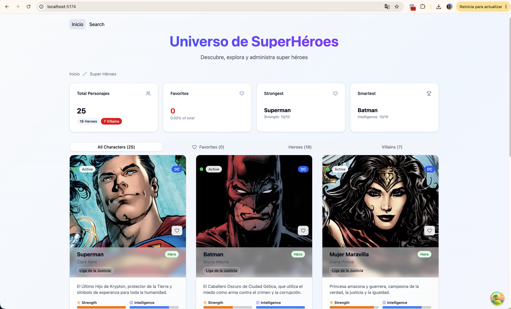

# 🧪 ¿Qué estamos ejecutando realmente?

Vamos a probar una aplicación sencilla.

Descarga la parte front:

[Heroes React Front](https://github.com/igijon/react_heroes_app)

[Heroes Node Back](https://github.com/igijon/react_heroes_app)

Abrimos los dos proyectos en VSCode y analizamos su estructura.

Analizamos el ficher `package.json`:
- Tenemos que ver los scripts de ejecución
- Tenemos que ver las dependencias que tienen

## Montamos nuestro proyecto back

```bash
npm install
npm run start:dev
```

## Montamos nuestro proyecto front

```bash
npm install
npm run dev
```

Debes ver algo como esto en el navegador:



## Cuestionario

- ¿Qué dependencias observas y de qué tipo en cada componente de la aplicación?
- Observa el tráfico de red que se produce, request y response correspondientes cuando interactúas con la aplicación y haz un esquema de lo que has obtenido:
  - Request indicando tipo y respuesta
  - Respuesta JSON obtenida
  

  