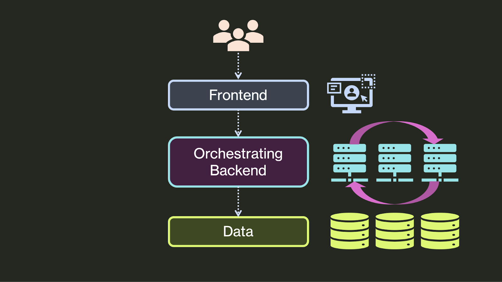
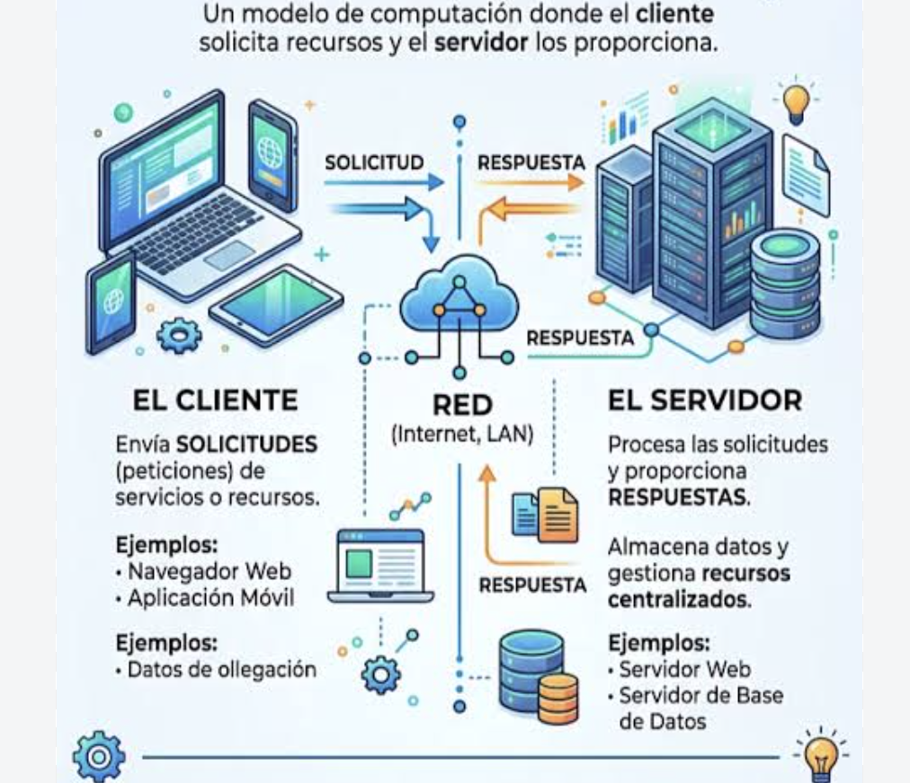
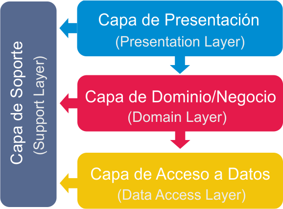
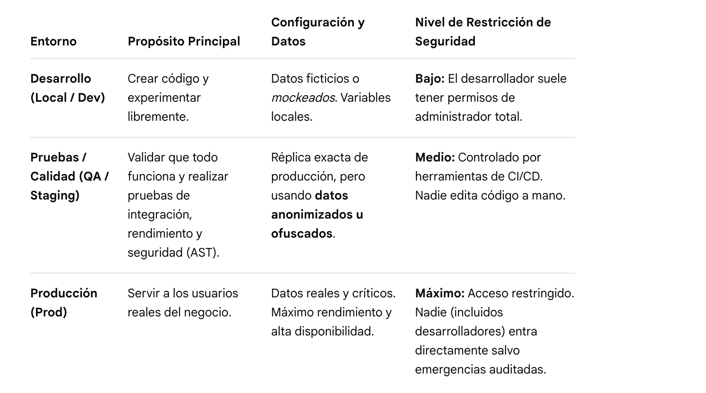

1. El ecosistema de una aplicación
Componentes.
Dependencias.
Entornos de desarrollo, pruebas y producción.
1. Primera aproximación a la seguridad
Entradas externas.
Superficie de ataque.
Seguridad desde el diseño.
1. Nuevas aplicaciones
Aplicaciones integradas con LLM.
Nuevos componentes y superficie de ataque.


> **¿Qué ocurre desde que escribimos código hasta que un usuario utiliza una aplicación?**

# 📚 1. Aplicaciones modernas

Una aplicación o app es un programa informático diseñado para ayudar al usuario a realizar una tarea específica.

Una aplicación moderna combina muchas piezas para ofrecer una experiencia rápida y conectada en cualquier dispositivo:

- **Frontend:** Es la interfaz visual con la que interactúa el usuario en su pantalla. Se diseña para navegadores web o teléfonos móviles.
- **Backend:** Es el servidor que procesa las reglas del negocio, la seguridad y las peticiones del usuario de forma oculta.
- **Base de datos:** Es el sistema seguro donde se guarda toda la información, como perfiles de usuarios, textos o imágenes.
- **APIs:** Funcionan como un puente de comunicación para que el frontend, el backend y otros servicios externos compartan datos al instante.

Los productos finales los podemos encontrar como aplicaciones web o móviles, por ejemplo.



> **¿Qué parte tenemos que proteger?**
>
> **Todas**


# 💻 2. Del código fuente a la ejecución

El código fuente es lo que escribe el desarrollador, por ejemplo:

```js
function login(user, password) {
    // ...
}
```

Pero una aplicación no termina aquí.
Tenemos:

> **Código fuente -> Transformación (dependiendo del lenguaje) -> Ejecución -> Aplicación **

## Lenguajes compilados e interpretados

### Lenguajes Compilados

> Código fuente → Compilador → Programa ejecutable → Ejecución

Ejemplos: C, C++, Rust, Java (con matices), Kotlin (con matices)

### Lenguajes Interpretados

> Código fuente → Runtime → Ejecución

JavaScript → Node.js (lado del servidor), navegador web (lado del cliente)

Python → Python runtime

Por ejemplo si JavaScript se puede ejecutar en el lado del servidor o en el navegador web y esto es fundamental tenerlo en cuenta para posteriormente ver cosas como:

- Vulnerabilidades
- Dependencias
- Configuración
- Contenedores
- Servidores…

# 🍢 Seguridad de lenguajes y runtimes

>**No todos los lenguajes tienen las mismas características de seguridad**

Por ejemplo, en la **gestión de memoria**, algunos lenguajes permiten trabajar directamente con memoria y otros la gestionan automáticamente.

**C/C++**:  + control ⇒ + responsabilidad.

**JS/Python/Java:** Gestión automática de la memoria.

>Esto no quiere decir que “JavaScript sea seguro”.
>**Un lenguaje puede reducir determinados tipos de errores, pero ninguna tecnologían convierte automáticamente una aplicación en segura.
**

Por ejemplo, una aplicación JavaScript puede tener:

- **XSS** (*Cross-Site Scripting*) es una vulnerabilidad de seguridad informática que permite a un atacante inyectar código malicioso (generalmente JS) en una página web legítima para que se ejecute en el navegador de otros usuarios.
- Problemas de autenticación
- Exposición de secretos
- Dependencias vulnerables

# 📟 3. Arquitectura y comunicación

## Arquitectura cliente-servidor



**El Cliente:** Es la aplicación o dispositivo del usuario (como un navegador web o una app en el móvil) que inicia la comunicación haciendo peticiones. 

**El Servidor:** Es el equipo o programa remoto con mayores recursos encargado de procesar las solicitudes, gestionar bases de datos y devolver los datos requeridos. 

**Cómo Funciona**

1. El usuario interactúa con el **cliente** y realiza una acción o petición (por ejemplo, entrar a una página web).
2. El cliente envía un mensaje a través de la red usando protocolos como **HTTP o HTTPS**.
3. El **servidor** recibe la petición, hace el trabajo pesado (busca en la base de datos, procesa los datos) y genera una respuesta.
4. El servidor envía la información de vuelta al cliente, que se encarga de mostrarla de forma visual en la pantalla.

## HTTP y HTTPS

La diferencia principal entre **HTTP** y **HTTPS** es que **el segundo cuenta con una capa de seguridad y cifrado para proteger los datos, mientras que el primero los transmite de forma abierta**. 

**¿Qué es HTTP?**

Significa *Hypertext Transfer Protocol* (Protocolo de Transferencia de Hipertexto).

Envía la información en texto plano entre el navegador y el servidor.

No ofrece cifrado, por lo que terceros pueden leer o robar los datos fácilmente si los interceptan. 

**¿Qué es HTTPS?**

Significa *Hypertext Transfer Protocol Secure* (Protocolo de Transferencia de Hipertexto Seguro).

Añade los protocolos de seguridad **SSL o TLS** para cifrar los datos intercambiados.

Protege la información confidencial, como contraseñas o números de tarjetas de crédito.

Valida la identidad del servidor web para evitar suplantaciones.


>**HTTPS** protege la comunicación pero **NO GARANTIZA** que la aplicación sea segura.

## APIs REST

Un **API REST** es un conjunto de reglas que permite que diferentes aplicaciones se comuniquen entre sí mediante HTTP/HTTPS.

El acrónimo significa *Application Programming Interface* (Interfaz de programación de aplicaciones) y *REpresentational State Transfer* (Transferencia de estado representacional).

>Funciona como un puente o traductor para que un sistema pida datos o funciones a otro y obtenga una respuesta clara.

### ¿Cómo funciona?

Una API REST funciona mediante un modelo de cliente y servidor:

- **El cliente**: Es quien hace la petición, como una aplicación móvil, una página web o tu navegador.
- **El servidor**: Es el sistema que recibe la petición, procesa la información en el *backend* (como buscar en una base de datos) y devuelve un resultado.
 
Los datos se suelen enviar y recibir en formato , que es un formato de texto ligero.
 
 ### Request/response

 **Request (Solicitud / Petición):** Es el mensaje que envía el cliente (por ejemplo, tu navegador web) pidiendo un recurso, datos o una acción al servidor. Incluye métodos como `GET` o `POST`, cabeceras y datos. 

**Response:** Es el mensaje que el servidor devuelve al cliente tras procesar la solicitud. Incluye un código de estado (como 200 para éxito o 404 para no encontrado) y la información solicitada.

### Métodos y códigos básicos

**Métodos HTTP básicos (Acciones)**

Los métodos indican al servidor **qué acción** se desea realizar sobre un recurso.

• **GET:** Solicita datos o información de un servidor. **No modifica nada** en el servidor, solo lee (por ejemplo, cargar una página web o ver un perfil).
• **POST:** Envía datos al servidor para **crear un nuevo recurso** (por ejemplo, registrar un nuevo usuario o publicar un comentario).
• **PUT:** Envía datos para **actualizar por completo** un recurso existente. Si no existe, a veces lo crea.
• **DELETE:** Solicita la **eliminación** de un recurso específico en el servidor.
• **PATCH:** Aplica **modificaciones parciales** a un recurso (a diferencia de PUT, no lo reemplaza entero).

**Códigos de estado HTTP básicos (Respuestas)**

Los códigos son números de tres dígitos que el servidor devuelve para indicar el **resultado de la petición**. 

Se dividen en grupos según su primer dígito:

**🟢 2xx: Éxito (Todo salió bien)**
• **200 OK:** La petición fue exitosa y el servidor devuelve los datos solicitados.
• **201 Created:** La petición fue exitosa y se ha **creado un nuevo recurso** (común tras un POST).

**🟡 3xx: Redirección (Hay que ir a otro lado)**
• **301 Moved Permanently:** El recurso solicitado se ha mudado de forma permanente a una nueva dirección (URL).
• **302 Found:** El recurso está temporalmente en otra dirección.

**🔴 4xx: Errores del Cliente (El error está en tu petición)**
• **400 Bad Request:** El servidor no entiende la petición porque está mal redactada o corrupta.
• **401 Unauthorized:** No tienes permiso para ver el recurso; necesitas **iniciar sesión**.
• **403 Forbidden:** El servidor entiende quién eres, pero **tienes prohibido** el acceso a ese recurso.
• **404 Not Found:** El recurso solicitado **no existe** o no se pudo encontrar en el servidor.

**🟣 5xx: Errores del Servidor (El error es de la web/sistema)**
• **500 Internal Server Error:** El servidor encontró una condición inesperada que le impide cumplir con la petición (un fallo genérico en el código del servidor).
• **503 Service Unavailable:** El servidor **no está disponible** temporalmente, generalmente por mantenimiento o sobrecarga.

## JSON

**JSON** (JavaScript Object Notation) es técnicamente un formato ligero de intercambio de datos basado en texto plano, diseñado para ser fácil de leer y escribir por humanos, y fácil de interpretar y generar por computadoras.

A pesar de que su nombre incluye "JavaScript" y nació como una simplificación de la sintaxis de objetos de ese lenguaje, hoy en día **es un estándar completamente independiente del lenguaje** y es compatible con prácticamente cualquier tecnología (Python, Java, PHP, C++, etc.).

### Estructura técnica

Un archivo o cadena JSON está compuesto exclusivamente por dos estructuras de datos universales:

- **Colecciones de pares clave/valor**: En la mayoría de los lenguajes, esto se traduce como un objeto, diccionario, hash table o registro.
- **Listas ordenadas de valores**: En los lenguajes de programación, esto se traduce como un arreglo (array), lista o vector.

### Ejemplo

```js
{
  "usuario_id": 10543,
  "nombre": "Elena",
  "es_administrador": false,
  "telefonos": [
    "+34 600 000 000",
    "+34 910 000 000"
  ],
  "configuracion": {
    "tema": "oscuro",
    "notificaciones": true
  },
  "ultimo_acceso": null
}

```

>**Los datos que llegan desde fuera no son confiables**

## Arquitectura por capas



La **arquitectura por capas** (o Layered Architecture) es un patrón de diseño de software que consiste en dividir una aplicación en secciones horizontales, donde cada capa tiene un rol y una responsabilidad única. 
Se fundamenta en el principio de **separación de responsabilidades** (Separation of Concerns), lo que significa que cada nivel procesa una tarea específica y se comunica únicamente con sus capas adyacentes de manera jerárquica.

### Estructura tradicional (arquitectura de 3 capas)

Aunque un sistema puede configurarse con múltiples niveles (N-capas), el modelo estándar de la industria organiza el software en tres capas lógicas esenciales:

- **Capa de Presentación** (Interfaz de Usuario / UI): Es el punto de contacto directo con el usuario final. Se encarga de capturar las acciones del cliente, enviar los datos a la capa inferior y renderizar de forma visual la información de retorno (páginas web, apps móviles, HTML, etc.).
- **Capa de Lógica de Negocio** (Capa de Aplicación / BLL): Actúa como el motor del sistema. Modela, calcula y procesa todas las reglas operativas, validaciones y transformaciones de datos requeridas por la empresa. Nunca accede directamente al almacenamiento.
- **Capa de Acceso a Datos** (Persistencia / DAL): Su único objetivo es gestionar la comunicación con los almacenes de información (bases de datos SQL/NoSQL, archivos físicos o APIs de terceros). Recibe solicitudes de la capa de negocio para extraer, actualizar o eliminar registros.

### Regla de acoplamiento cerrado

En una arquitectura limpia por capas, estas operan de forma **cerrada**. El flujo de datos viaja de forma estrictamente descendente: la capa de presentación solo puede llamar a la de negocio, y la de negocio solo a la de datos. Se prohíbe terminantemente "saltarse" niveles (por ejemplo, que la interfaz de usuario ejecute consultas SQL directas a la base de datos).

## Servidores y entornos de ejecución

>Mi aplicación funciona en local, ¿qué necesita para funcionar en producción?
>
>**Qué funcione en mi ordenador no significa que esté preparada para producción**

Ejemplo:

**Mi equipo MACOS -> Node.js -> Aplicación**

**Servidor -> Node.js -> Aplicación**

# 🌗 4. El ecosistema de una aplicación

## Componentes (la anatomía del software)

Para proteger un sistema, primero debemos conocer sus partes. Un sistema no es solo un archivo ejecutable; es un conjunto de piezas interconectadas:

- **Frontend** (Capa de Presentación): El código que se ejecuta en el cliente (navegador, app móvil). *Foco de seguridad*: Validación de datos en el cliente (que nunca sustituye a la del servidor) y protección contra ataques como XSS (Cross-Site Scripting).
- **Backend** (Lógica de Negocio y APIs): El núcleo que procesa los datos y gestiona los servicios. *Foco de seguridad*: Autenticación, autorización (RBAC) y sanitización de entradas.
- **Almacenamiento y Persistencia** (Bases de Datos, Caché): Dónde residen los datos (SQL, NoSQL, Redis). *Foco de seguridad*: Cifrado en reposo y en tránsito, y prevención de inyecciones (SQLi).
- **Servicios Periféricos y Middleware**: Pasarelas de pago, servidores de mensajería (RabbitMQ, Kafka) o servicios de identidad (OAuth/OIDC).

## Dependencias (el software de terceros)

Hoy en día, más del 80% del código de una aplicación moderna proviene de librerías de código abierto y frameworks (npm, PyPI, NuGet, Maven).

### ¿Qué es una dependencia?

Código preescrito por terceros que integramos para no reinventar la rueda (ej. Express en Node, SQLAlchemy en Python).

### Dependencias Transitivas

Las librerías que tus librerías necesitan. Un riesgo invisible si no se monitoriza.

### Riesgos de Seguridad Asociados

- **Vulnerabilidades conocidas (CVEs)**: Fallos de seguridad descubiertos en versiones antiguas de una librería.
- **Ataques a la Cadena de Suministro (Supply Chain Attacks)**: Inyección de código malicioso en repositorios públicos por el secuestro de la cuenta de un desarrollador legítimo.

### Buenas Prácticas de Producción Segura

- Uso de herramientas **SCA (Software Composition Analysis)** como npm audit, Snyk o OWASP Dependency-Check integradas en el pipeline. 

- Fijar versiones exactas (lockfiles) para evitar sorpresas en el despliegue.

## Entornos de desarrollo, pruebas y producción

Una regla de oro en la puesta en producción segura es el aislamiento. El software debe pasar por distintas "cajas de arena" (*sandbox*) antes de llegar al usuario final.



### Conceptos clave de la seguridad en entornos

- **Principio de Menor Privilegio**: Los desarrolladores no deben tener acceso a las credenciales ni a las bases de datos de producción.
- **Gestión Segura de Secretos**: Prohibido guardar contraseñas, tokens de API o claves criptográficas en el código fuente (Git). Se deben inyectar en tiempo de ejecución usando gestores de secretos (Vault, AWS Secrets Manager, GitHub Secrets).
- **Paridad de Entornos**: Los entornos de QA y Producción deben ser lo más idénticos posibles (mediante Contenedores/Docker e Infraestructura como Código - IaC) para evitar el clásico "en mi máquina sí funcionaba".

